# 🍽️ Crave Hub – Meal Delivery Web Application

**Crave Hub** is a full-stack **Django-based meal delivery web application** that enables users to explore restaurants, browse menus, add items to cart, and place orders, while providing admins full control over restaurant and menu management.

---

## 🚀 Features

### 👤 User Features
- User registration & login
- Browse restaurants
- View restaurant menus
- Add food items to cart
- Proceed to payment

### 🛠️ Admin Features
- Admin login
- Add restaurants
- View restaurants
- Update restaurant details
- Update menu items
- Delete restaurants

---

## 🛠 Tech Stack
- **Backend:** Django, Python  
- **Frontend:** HTML, CSS, Bootstrap  
- **Database:** SQLite  
- **Version Control:** Git & GitHub  

---

## 📸 Project Screenshots

### 🏠 Landing & User Pages

**Home Page**  


**User Sign In**  
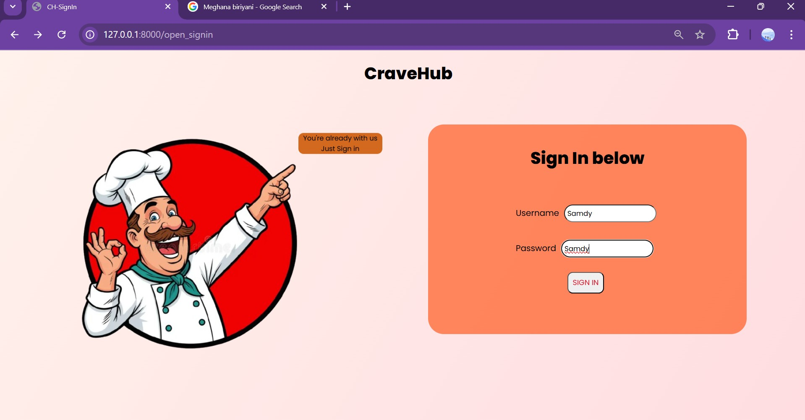

**User Sign Up**  


**User Home**  
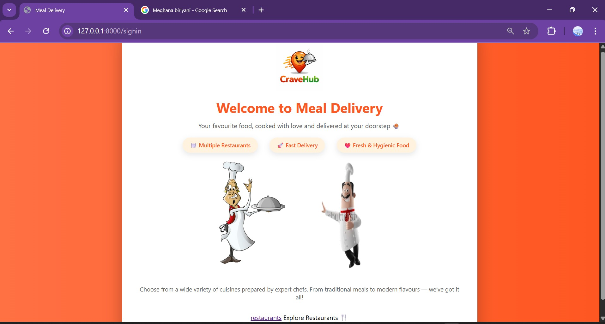

---

### 🍴 Restaurant & Menu Flow

**View Restaurants**  
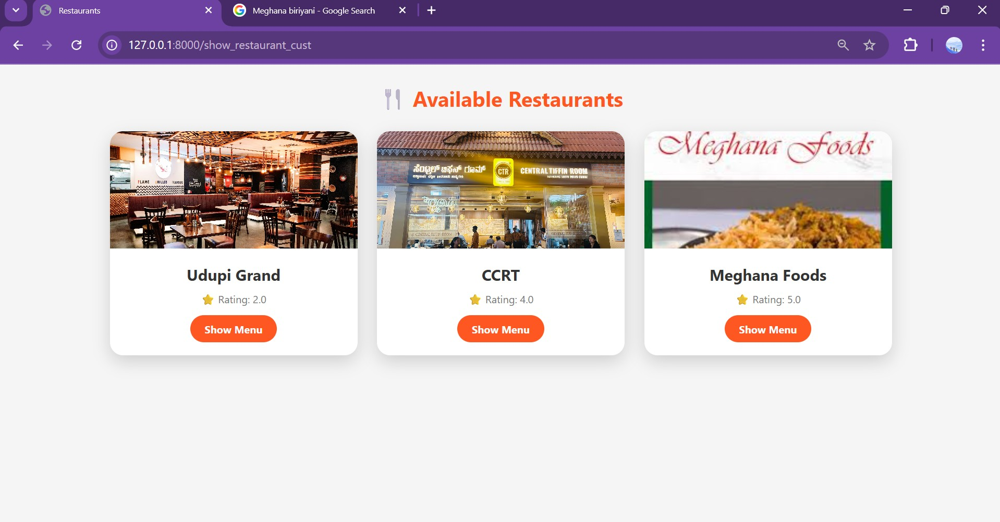

**View Menu**  
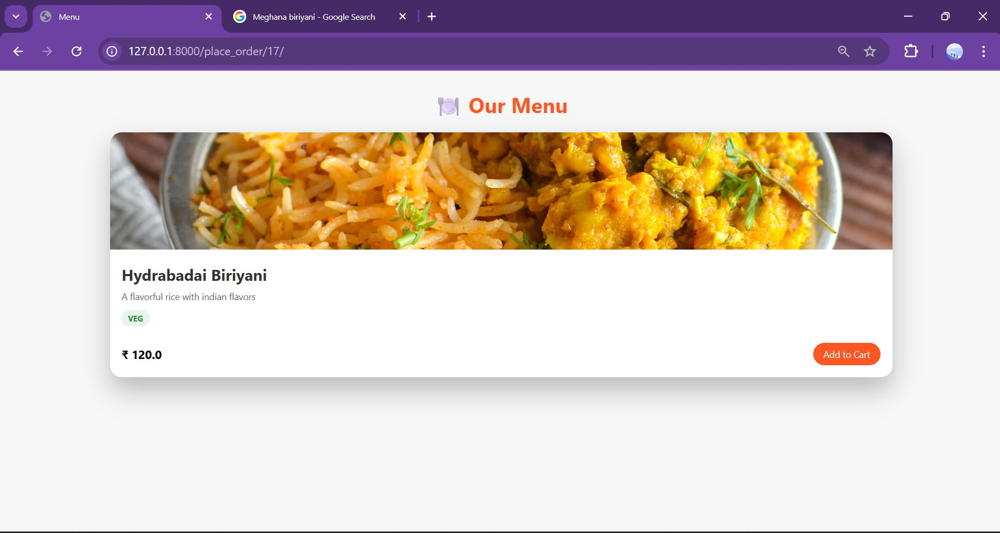

**Add to Cart**  
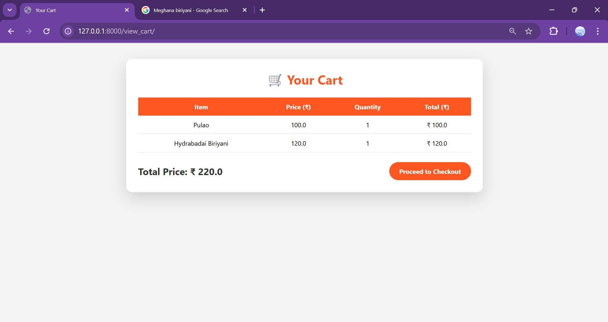

---

### 💳 Payment Flow

**Proceed to Pay**  
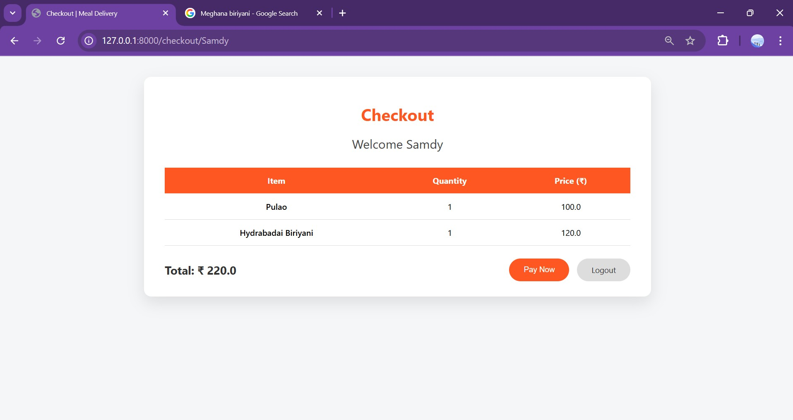

**Payment Page**  
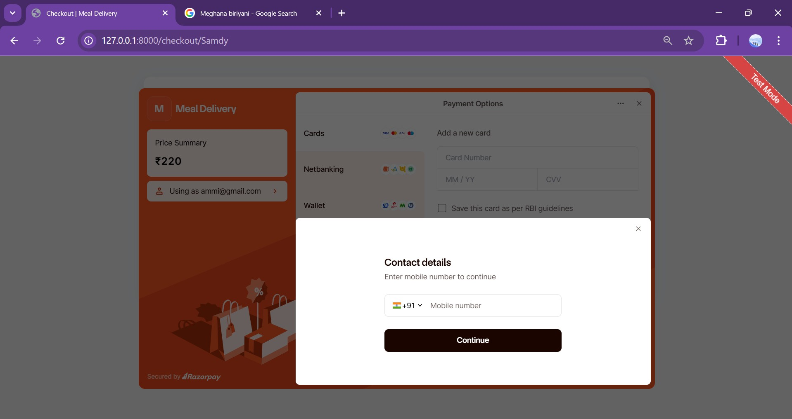

---

### 🔐 Admin Panel

**Admin Sign In**  
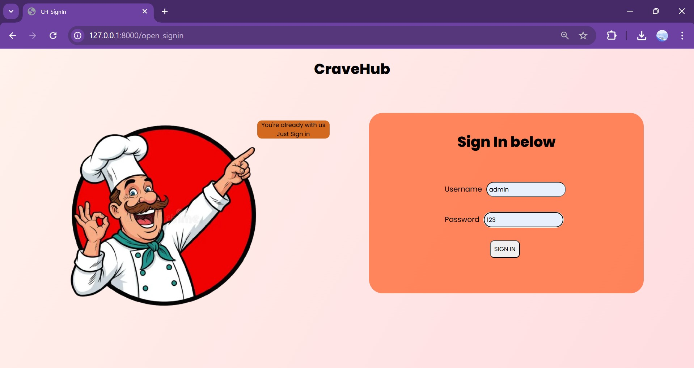

**Admin – Add Restaurant**  
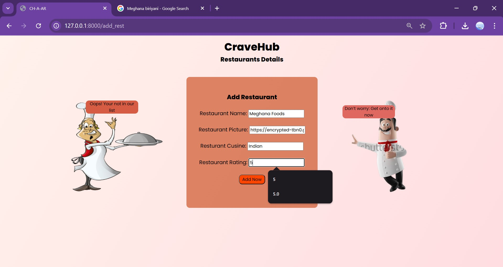

**Admin – View Restaurants**  
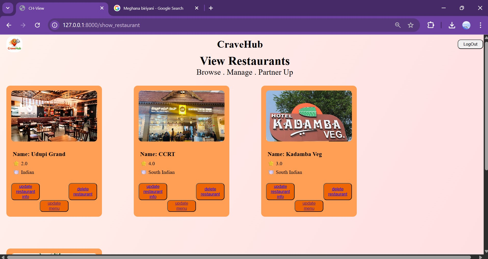

**Admin – Update Restaurant**  
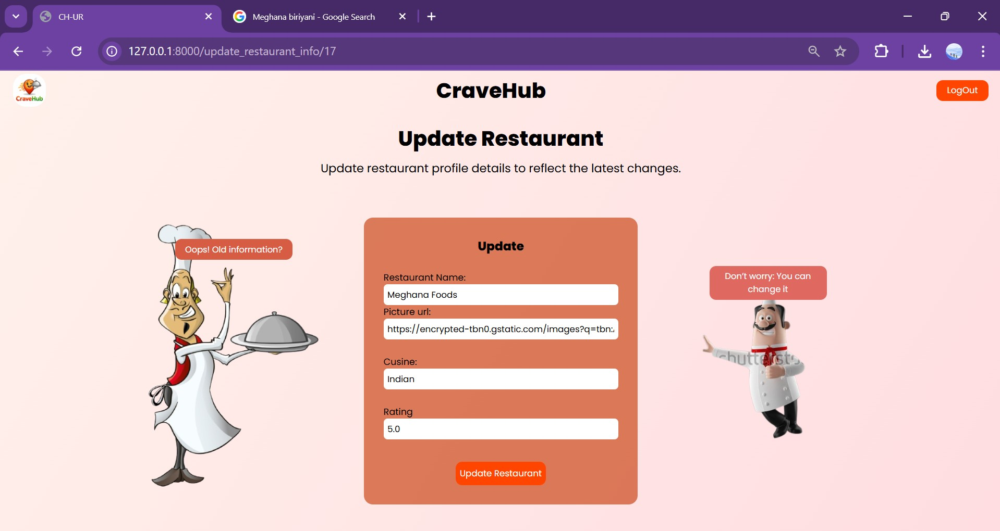

**Admin – Update Menu**  
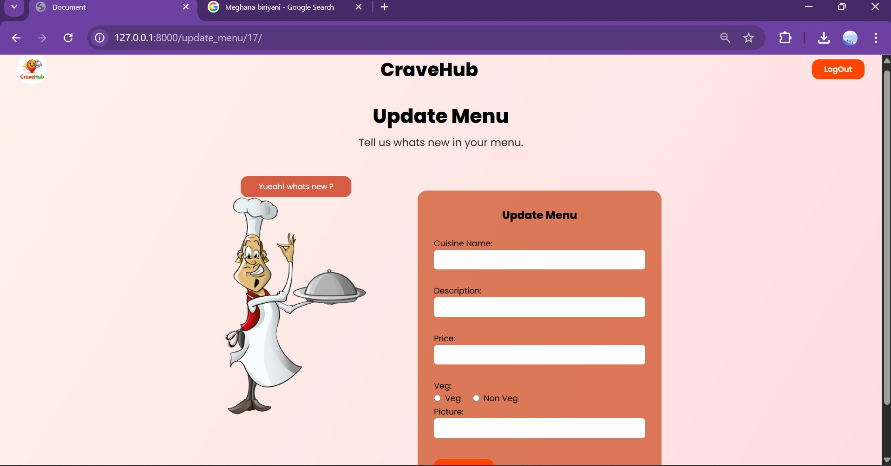

**Admin – Delete Restaurant**  
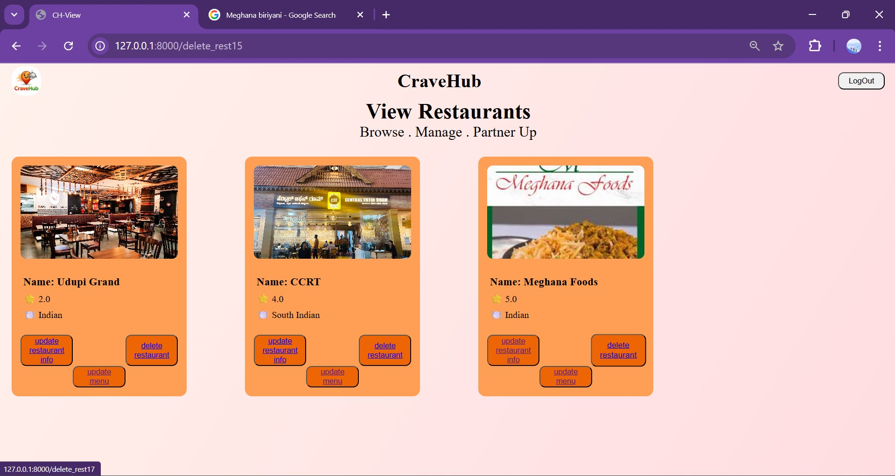

---

## 🧑‍💻 How to Run the Project Locally

```bash
git clone https://github.com/ShreyaAnand1709/crave_hub.git
cd crave_hub
python -m venv venv
pip install -r requirements.txt
python manage.py runserver
